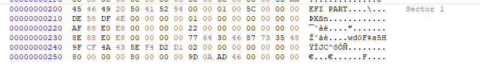
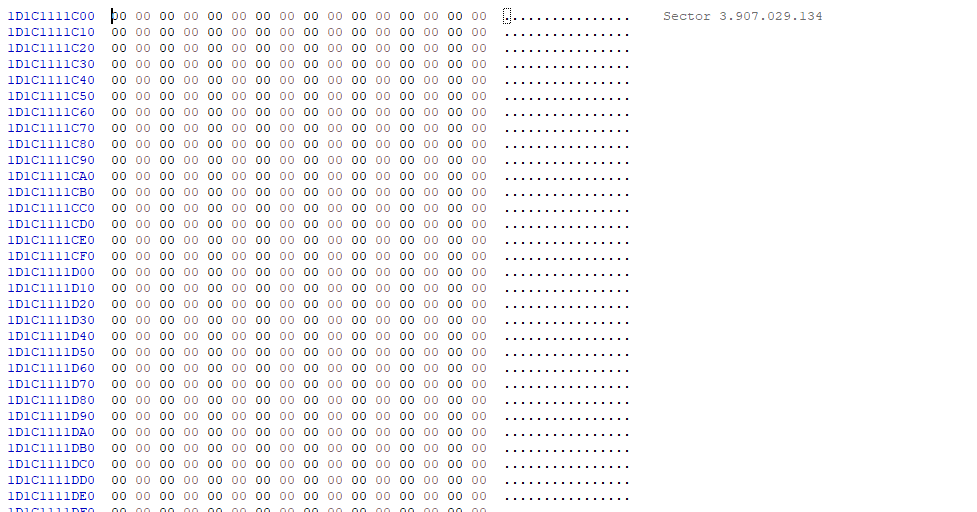

# What is the difference between BIOS and UEFI?

Often I hear people talking about changing BIOS settings on their computer. For example, changing the boot order in the *BIOS* to be able to install a new OS. Were it the year 1995, that would be fine. But in 2024 BIOS systems are mostly long gone. In this blog I will write a brief description of BIOS and UEFI and the boot processes for both. This blog is by no means an exhaustive list of differences, it is just to make you aware that there are in fact differences. I will also show my hands-on experience analyzing my own disk using HxD.

## What exactly is a BIOS?

*BIOS* stands for *"basic input/output system".* When booting up a computer, the BIOS is responsible for initializing your input and output devices, like your screen and keyboard. The BIOS firmware is stored in a BIOS chip on the motherboard. BIOS was first used in 1981, in the first IBM PC. Considering the date, you might suspect that over four decades later, BIOS systems could be *mildly* outdated.

### The BIOS boot process explained
You turn your pc on. The first thing that happens is a *power on self test* (or *POST*), in this stage, the system checks things like "Is there a CPU installed?" "is the memory functional?". Then, the BIOS itself is initialized. The input and output buffers of your devices are linked to the input output buffers on the I/O controller of your motherboard. After this, the BIOS firmware will check for bootable partitions in the *partition table* (more on that later). If it finds multiple, it will check the configurable boot order (which is the same boot order that you change when booting from a USB drive to install a new operating system) to determine which partition to boot from.

Partitions are split into 512 byte sectors. If a partition is bootable, the last two bytes in the first sector are "55aa", this is the signature for a bootable partition. This first sector is called the *master boot record* (*MBR*). The BIOS will load this sector into RAM memory, at address 0x7c000. The BIOS then sets the instruction pointer to 0x7c000 and the CPU will start executing the instructions found in the MBR. The MBR consists of:

* up to 446 bytes of bootstrap code
* 64 bytes of partition table (4x16 byte partition entries)
* 2 bytes of the boot signature

446 + 64 + 2 = 512 bytes, so the math checks out. 

The bootstrap code's job is to load the second bootloader, it does so by checking the contents of the partition table. Each entry of the partition table consists of:

* 1 byte boot indicator, if most significant bit is 1, partition is considered bootable
* 3 byte start address, 1 byte for each cylinder, sector and head (if you're interested what this means, look up CHS addressing)
* 1 byte indicating the partition type (e.g 0x07 NTFS)
* 3 byte end address in CHS
* 4 byte starting *logical block address* (*LBA*) address, this is simply treating each 512 byte sector as an index
* 4 byte size of partition in sectors

Can you see the drawback of this partition table format? What is the max value of an unsigned 4 byte value? 

$(2^{32} - 1) = 4,294,967,295 \text{ sectors}$

There are 512 bytes in a sector

$4,294,967,295 \cdot 512 = 2,199,023,255,040 \text{ bytes}$

So the maximum partition size is 2 terabytes. Certainly no issue back in 1985, but nowadays it is. 

## What is UEFI?
*UEFI* stands for *"Unified Extensible Firmware Interface"*. It essentialy achieves everything a BIOS does and more, but also better. 

### The way a UEFI system boots up
The first three steps of booting are the same as on BIOS. Power on self test followed by hardware and firmware initialization followed by trying to boot in the configured boot order. After these three steps, they start to differ. On UEFI systems, the *GUID partition table* (*GPT*) is checked for each physical storage device. Each physical storage device has a GPT header, each GPT header contains the memory address of the actual *partition entry array*, which in itself contains addresses of each partition. A partition is considered bootable if it's partition entry in the partition entry array has the *EFI System Partition* type GUID (C12A7328-F81F-11D2-BA4B-00A0C93EC93B)

#### format of the GPT and partition entry array
The GPT consists of:

| Field                                     | Description                                                                                      | Size (Bytes) |
|------------------------------------------------------|----------------------------------------------------------------------------------------------------------|--------------|
| Signature (EFI PART)                                | signature (EFI PART spelled out in ASCII)                                                     | 8            |
| Version                                              |designating for the version of GPT used                                                          | 4            |
| Header Size                                          | the size of the GPT header, typically 92 (0x5c)                                               | 4            |
| CRC32 Checksum                                       | CRC32 checksum for the header (this field is zeroed out for calculation of the checksum)       | 4            |
| Reserved                                             |  reserved                                                                                         | 4            |
| Current LBA Address                                  | address of the current LBA (typically 1)                                                 | 8            |
| Backup GPT LBA                                      | LBA of the backup GPT                                                                     | 8            |
| First Usable Sector LBA                              | LBA of the first usable sector                                                            | 8            |
| Last Usable Sector LBA                               | LBA of the last usable sector                                                             | 8            |
| Disk GUID                                            | globally unique identifier for the disk                                                    | 16           |
| Partition Entry Array Start LBA                      | starting LBA of the *partition entry array* (usually 2, the sector after the GPT header)       | 8            |
| Number of Partition Entries                          | the number of partition entries in the partition entry array                                  | 4            |
| Size of Each Partition Entry                         | size of each partition entry, typically 128 (0x80)                                             | 4            |
| Partition Entry Array Checksum                       | checksum for the partition entry array                                                        | 4            |
| Reserved                                             | reserved for future use                                                                         | 420          |

$16 + 8 \cdot 6 + 4 \cdot 7 + 420 = 512\text{ bytes}$, exactly one sector.

An entry in the partition entry array consists of:

* 16 bytes of GUID for the partition type
* 16 bytes of the partition GUID
* 8 bytes of the first LBA of the partition
* 8 bytes of the last LBA of the partition
* 8 bytes of attribute flags, properties like read-only etc.
* 72 bytes for the partition name

| Field Description                                    | Provided Description                                                                                      | Size (Bytes) |
|------------------------------------------------------|----------------------------------------------------------------------------------------------------------|--------------|
| GUID for Partition Type                             |  GUID for the partition type                                                                   | 16           |
| Partition GUID                                      | the partition GUID                                                                            | 16           |
| First LBA of the Partition                          | first LBA of the partition                                                                 | 8            |
| Last LBA of the Partition                           | last LBA of the partition                                                                  | 8            |
| Attribute Flags                                     | attribute flags, properties like read-only etc.                                                | 8            |
| Partition Name                                      | for the partition name                                                                           | 72           |

$16 \cdot 2 + 8 \cdot 3 + 72 = 128\text{ bytes}$.

Now let's take a look at the limitiations in partition size. There is no direct field indicating the size, so we'll have to do a little more deduction. Assume that we use a 512 byte sector size (it is the minimum size in UEFI systems). Since we're looking for a maximum partition size, let's minimize the partition entry array to just one single partition, 128 bytes, but we work with LBA and thus have to reserve one sector for this single entry. The "overhead" is thus $512 \cdot 2 = 1024 \text{ bytes}$.

The starting LBA is thus 2, We have an 8 byte value for the last LBA of the partition. The max value of an unsigned 8 byte number is $2^{64} - 1 = 18,446,744,073,709,551,615$. 

The amount of sectors that this partitions span is thus:

$18,446,744,073,709,551,615 - 2 = 18,446,744,073,709,551,613$

Let's not forget that we assumed the minimum amount of bytes for a sector, 512:

$18,446,744,073,709,551,613 \cdot 512 = 9,444,732,965,739,290,709,056 \text{ bytes} = 9.44 \text{ zettabytes}.$

To put this into contrast, the total amount of data on the internet (as of writing in 2024) falls in the ballpark of zettabytes. Surely that is enough for the foreseeable future for a single partition. We even assumed the smallest sector size in the process. 

### Taking a look at your own storage drives
I'll be using the HxD editor for checking my disk in this part. So far I have laid out a lot of information that should allow us to open the actual raw data on our drives 

Make sure to open the physical disk, not the logical disk. The logical disk does not contain all the stuff we just discussed.

Upon opening the disk, we skip over sector 0 and go to sector 1, which should contain the GPT header:

As we can see from the format provided earlier. The first 8 bytes are indeed "EFI PART". The version of the GPT header used is 1.0. The size of the header is 0x5C, 4 checksum bytes, 4 reserved bytes, 8 bytes for the LBA the GPT header is in (0x1), 8 bytes for the location of the backup GPT (0xE8E088AF), 8 bytes for the first usable sector (0x22), 8 bytes for the last usable sector (0xE8E0888E), 16 bytes of a GUID for the device, 8 bytes for the partition entry array address (0x2), 4 bytes denoting the amount of partitions (0x80), 4 bytes denoting the partition entry size (0x80), and 4 bytes for the checksum. 

that's quite a mouthful. Let's assess each field of interest from start to finish.

#### backup GPT header
First sanity check, in LBA 0xE8E088AF, I need to be able to see a copy of this GPT header. Converted to decimal 3,907,029,167

In this GPT header, we can see that the checksum is different, but that is expected because the GPT header is now located in this sector instead of sector 1. This is also the very last sector of my physical disk. That is probably so that the UEFI firmware can look up the backup table easily if the LBA in sector 1 is corrupted to the point where the backup LBA is invalid. The backup LBA for this GPT header points back to the original GPT header at LBA 1.

#### first usable sector
The next field, after the backup GPT header, is the first usable sector. It is 0x22, or 34 in decimal. Let's go to sector 34:

It's empty! Well, that's okay. There's probably good reason why it's empty.

#### last usable sector
The last usable sector is 0xE8E0888E. Let's go there.

Empty too! This might get a little boring... But the sector after that is at least modestly interesting and confirms we were on the right track.

I can see that there is "EFI system partition" is in there, as well as "Microsoft reserved partition". This is pretty close to the actual last sector on the disk, the sectors in between are all empty.

#### partition entry array fields
Skipping over the GUID of the GPT header, we find the usual 02 in the LBA of the partition entry array. I did in fact check if it's there, and it is. I'll come back to the partition entry array later. We alsof find I have 0x80 partition entries in the partition entry array and that they are 0x80 bytes each. We also see the checksum as the last 4 bytes before it goes to all 0s. 

Now we've brushed over all of the interesting GPT header contents, let's look at the partition entry array itself. I apparently have 0x80 (128) partition entries (from the information in the GPT header).

Let's do some maths, $512/128=4\text{ partition entries per sector}$. So, $128/4 = 32\text{ sectors}$ total or 0x20. The gpt header and the protective MBR together make up 2 sectors, followed by 32 sectors of partition array. Meaning, 34 sectors, which is 0x22. 0x22 was also the LBA of the first usable sector.

The first 16 bytes are the type GUID of the partition, as I've said earlier, the EFI System partition type GUID is C12A7328-F81F-11D2-BA4B-00A0C93EC93B. Which is (in mixed endian) present in the first 16 bytes. The first three groups are stores as little endian on the disk, the last two groups are stored as big endian. If you want to ask "why in mixed endian format?", so do I. But the answer to quirks in computer architecture is nearly always something along the lines of "backwards compatibility". Anyhow, we now know that this is a bootable device (and that's good, because I only have one storage device installed in my computer.)

We have another 16 bytes of the GUID for the disk itself. Now we have another 8 bytes of a first LBA, this time for the partition itself and we also have another 8 bytes for the last LBA. This partition starts at 0x800, and ends at 0x327FF. Followed by 8 bytes of attributes for the partition. Without going into further detail, this attribute setting means that this partition is required. Then we have 72 bytes for a partition name, which is "EFI system partition" in this case. This partition is the partition that contains the bootloader, device drivers and other utilities for booting into an operating system.

## Final words
I hope by now, it is clear what the difference is between BIOS and UEFI. I hope you learned something new today and I hope it wasn't boring. If you come this far then it must have not been too boring. 

